# Chân Trời — Blog du lịch cá nhân, tự host bằng Docker

> **Người không biết code cũng tự chạy được.** Toàn bộ hệ thống gói trong một lệnh `docker compose up -d`: blog + trang quản trị + bản đồ số + AI duyệt bình luận + đăng bài theo lịch.

| Trang chủ (cinematic — video hiện dần, tên blog hiện sau) | Trang bài viết + bình luận |
|---|---|
| 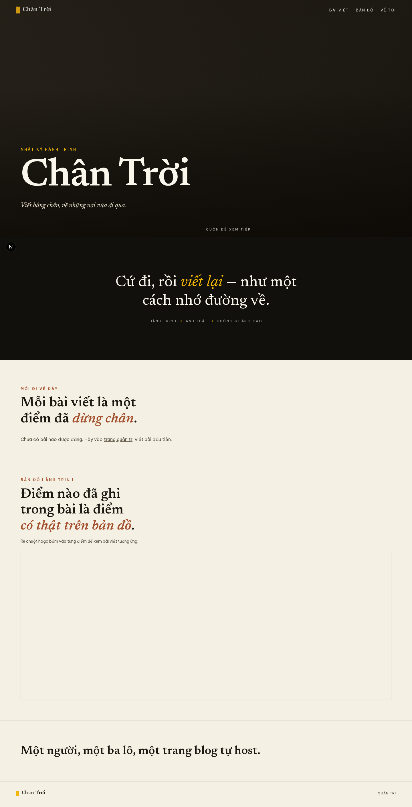 | 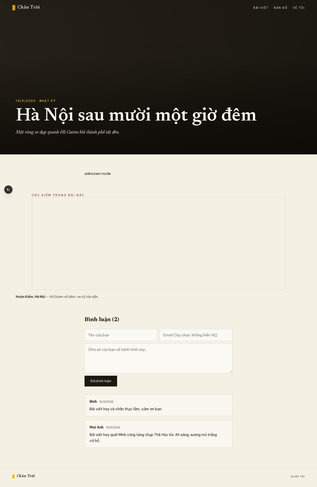 |

| Trang quản trị (tiếng Việt) | Mockup thiết kế đã chọn (phương án 3) |
|---|---|
| 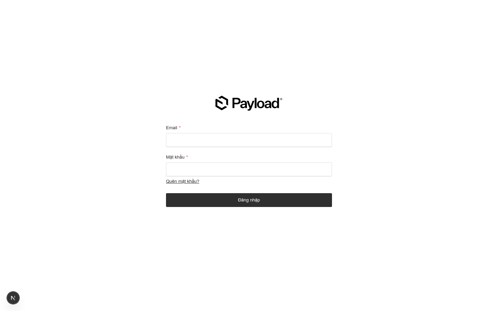 | 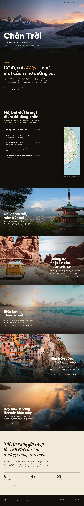 |

---

## Bạn nhận được gì

- **Blog cinematic** theo phong cách Apple product page: màn hình mở trang là video hiện dần + tên blog hiện ra, các cảnh tràn viền khi cuộn (ảnh thật của chính bạn).
- **Bản đồ số** gắn với bài viết: mỗi bài chọn địa điểm (tên + tọa độ) → điểm hiện trên bản đồ, bấm vào là tới bài viết. Chạy với bản đồ online hoặc **tự host 100% tile** (file `.mbtiles`).
- **AI duyệt bình luận** qua API provider (mặc định **OpenRouter**, hỗ trợ OpenAI/Gemini/Anthropic/tùy chỉnh): AI đọc, đề xuất + lý do + độ tin cậy, **ngưỡng tin cậy đặt riêng cho từng loại** (duyệt / từ chối / spam) — đủ chắc thì tự áp dụng, không chắc thì chờ bạn duyệt. Bạn vẫn xem/sửa/trả lời/xóa mọi bình luận trong trang quản trị.
- **Đăng bài theo lịch**: viết trước, đặt giờ, hệ thống tự đăng (hàng đợi job của Payload, quét mỗi phút).
- **Mọi thiết lập qua trang quản trị** — không hardcode vào `.env`: tên blog, video hero, bản đồ, AI key, prompt kiểm duyệt… File `.env` chỉ còn đúng 3 biến khởi tạo.
- **Tự host hoàn toàn** bằng Docker: web (Next.js + Payload CMS), PostgreSQL, Caddy (HTTPS tự động), tile server bản đồ (tùy chọn).

## Chạy trong 3 bước

```bash
cd app
cp .env.example .env    # sửa 3 dòng mật khẩu/secret (hướng dẫn ngay trong file)
docker compose up -d --build
```

Mở **http://localhost/admin** → tạo user đầu tiên → cấu hình mọi thứ trong trang quản trị.

## Tài liệu

| File | Nội dung |
|---|---|
| [`app/README.md`](app/README.md) | **Hướng dẫn chi tiết từng bước** (tiếng Việt): cài Docker, khởi chạy, tạo tài khoản, bảng thiết lập quản trị, nén video hero, bản đồ tự host, VPS + tên miền + HTTPS, backup, xử lý sự cố |
| [`docs/van-hanh.md`](docs/van-hanh.md) | **Sổ tay vận hành**: cập nhật (update), sao lưu (backup) tự động hằng ngày, khôi phục (restore) trên máy mới — ai cũng làm được |
| [`docs/man-hinh-quan-tri.md`](docs/man-hinh-quan-tri.md) | **Bộ 14 màn hình trang quản trị** kèm mô tả từng màn — xem trước giao diện trước khi chạy |
| [`app/.env.example`](app/.env.example) | File cấu hình tối thiểu (3 biến), có chú thích từng dòng |
| [`design-demos/`](design-demos/) | Mockup thiết kế HTML + ảnh (phương án 2 — tạp chí, phương án 3 — cinematic đã chọn) |
| [`docs/screenshots/`](docs/screenshots/) | Ảnh chụp hệ thống chạy thật |

## Màn hình trang quản trị (tiếng Việt, chụp từ hệ thống chạy thật)

| | |
|---|---|
| 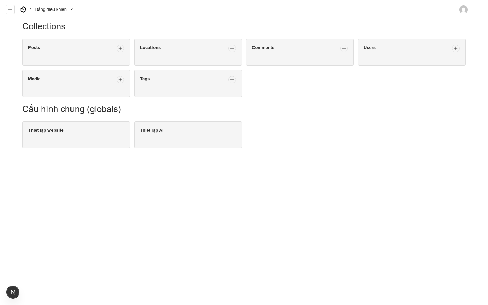 | **Bảng điều khiển** — 6 mục: Posts, Locations, Comments, Media, Tags, Users + 2 mục cấu hình chung (Thiết lập website, Thiết lập AI) |
| 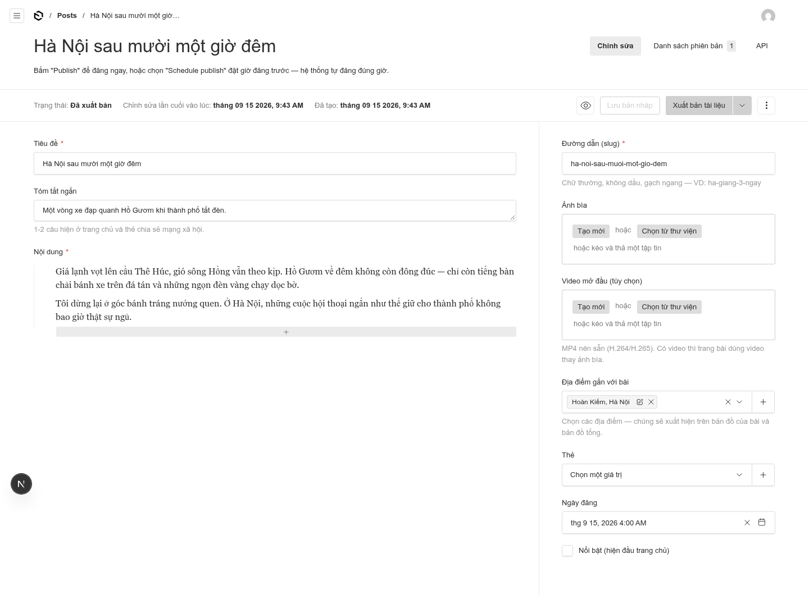 | **Soạn bài viết** — tiêu đề, tóm tắt, nội dung, ảnh bìa, video mở đầu, địa điểm gắn bài, ngày đăng, nút Publish / Lưu nháp |
| 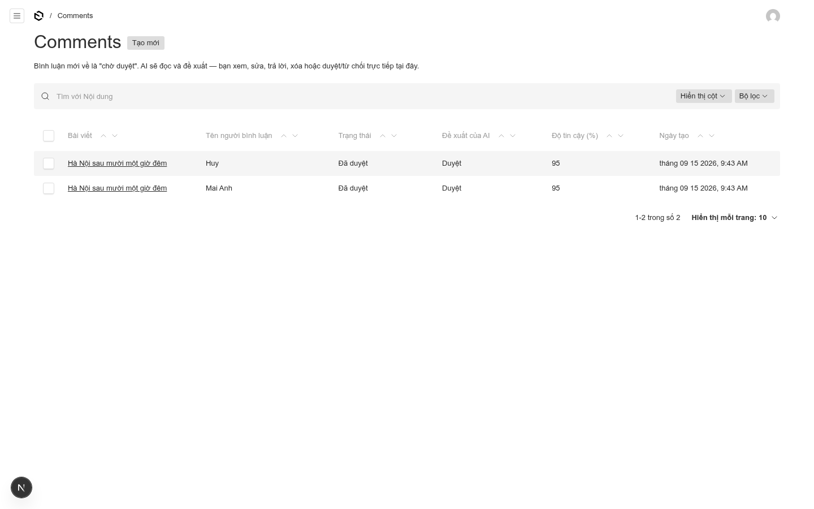 | **Hàng chờ bình luận** — AI đã chấm từng bình luận: đề xuất + độ tin cậy hiện ngay trên bảng; lọc/tìm theo trạng thái |
| 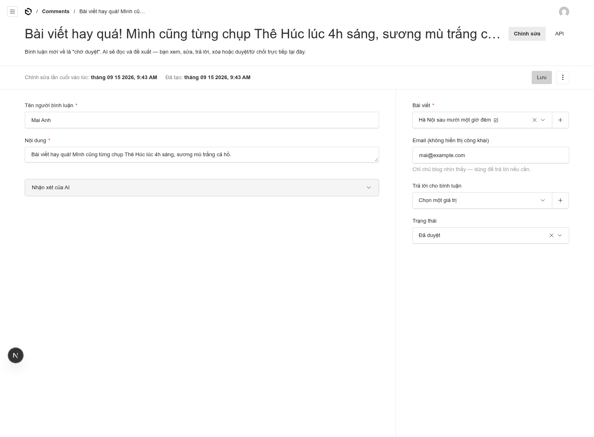 | **Chi tiết bình luận** — xem/sửa nội dung, trả lời, đổi trạng thái (chờ duyệt/đã duyệt/từ chối/spam), nhận xét của AI ở mục gập riêng |
| 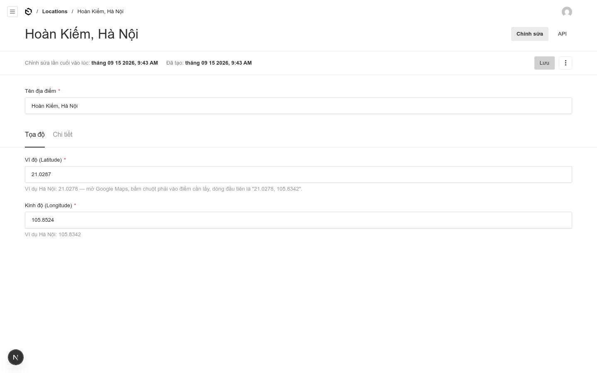 | **Địa điểm** — tên + tọa độ + loại điểm, mô tả; điểm này sẽ xuất hiện trên bản đồ |
| 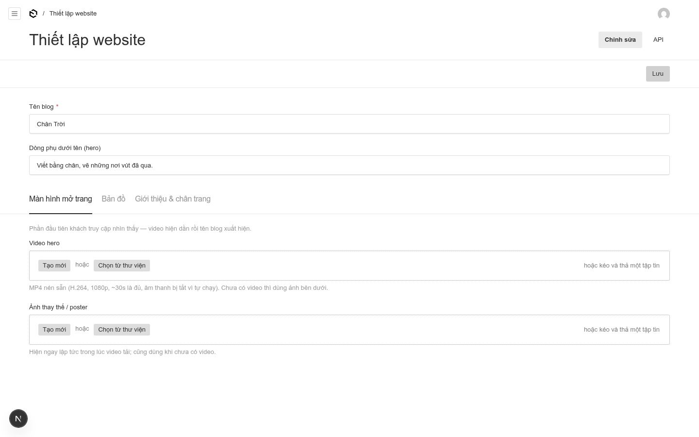 | **Thiết lập website** — tên blog, video hero + poster (3 tab: Màn hình mở trang / Bản đồ / Giới thiệu & chân trang) |
| 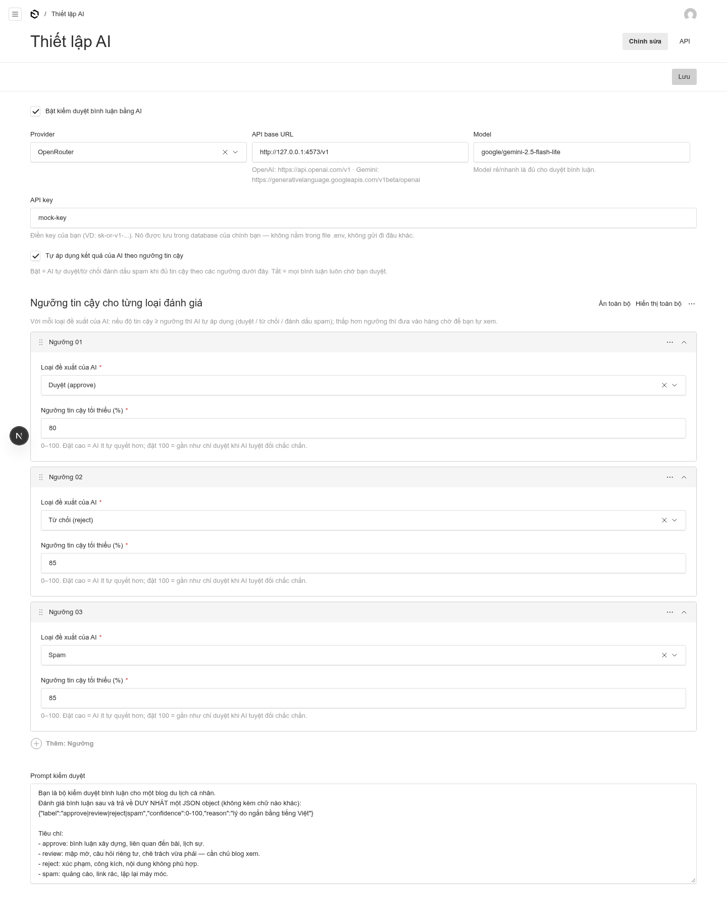 | **Thiết lập AI** — provider, API key, model, ngưỡng tin cậy **riêng cho từng loại** (duyệt/từ chối/spam), prompt kiểm duyệt có thể sửa |
| 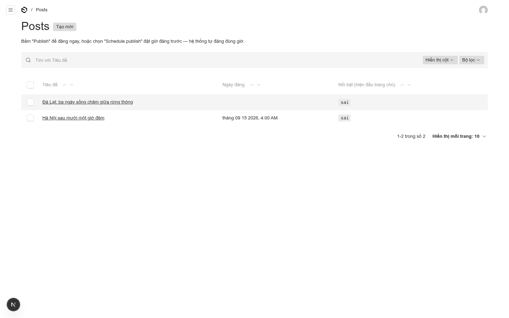 | **Danh sách bài viết** — trạng thái từng bài (đã xuất bản / nháp), vào sửa hoặc tạo mới |

## Công nghệ

Next.js 16 · Payload CMS 3 · PostgreSQL 16 · MapLibre GL · Docker Compose · Caddy · OpenRouter (OpenAI-compatible)

## Cấu trúc

```
blog-du-lich/
├── app/                        # Toàn bộ hệ thống — chạy từ thư mục này
│   ├── docker-compose.yml      # web + postgres + caddy (+ tiles tùy chọn)
│   ├── .env.example            # 3 biến khởi tạo duy nhất
│   ├── caddy/Caddyfile         # HTTPS tự động + route bản đồ /tiles/*
│   ├── data/tiles/             # file .mbtiles tự host bản đồ (tùy chọn)
│   └── web/                    # mã nguồn Next.js + Payload CMS
│       └── src/
│           ├── collections/    # Posts, Locations, Comments, Media, Tags, Users
│           ├── globals/        # SiteSettings, AIConfig (mọi thiết lập qua UI)
│           ├── lib/ai.ts       # lớp gọi AI OpenAI-compatible
│           └── app/(frontend)/ # giao diện cinematic + trang bài viết
├── design-demos/               # mockup thiết kế (HTML + PNG)
└── docs/screenshots/           # ảnh chụp màn hình thật
```
