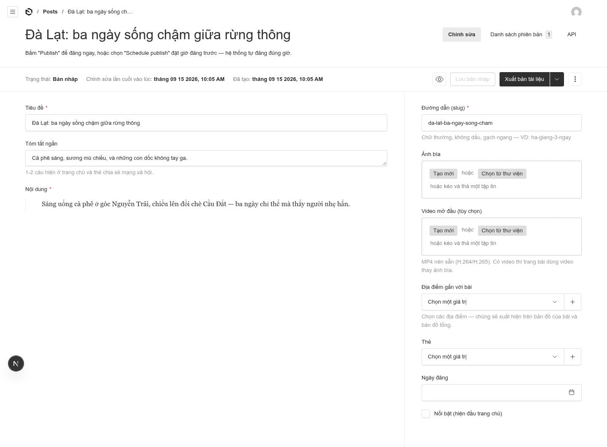
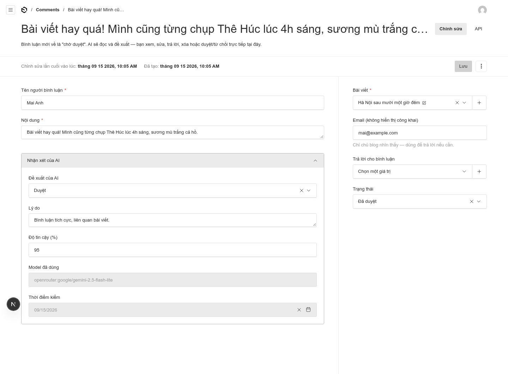
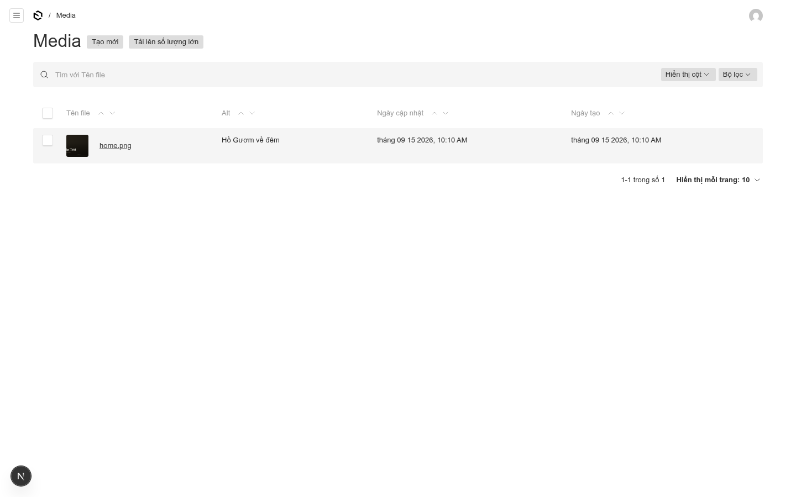
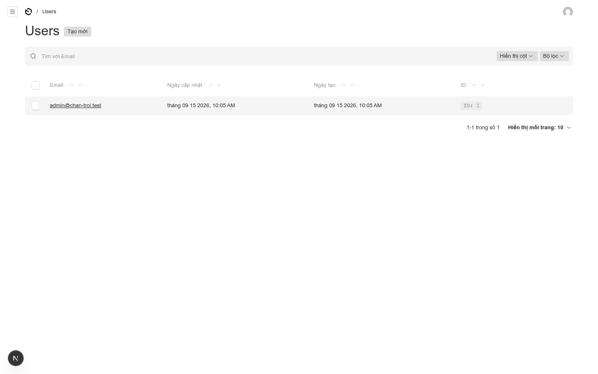
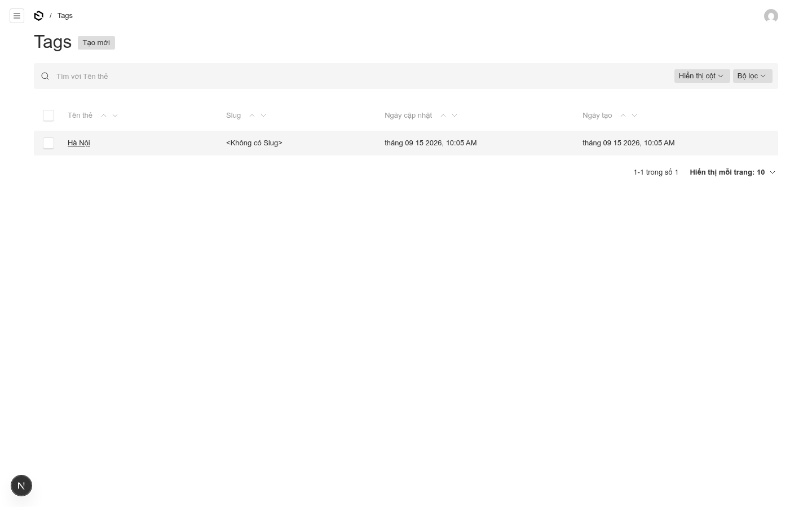

# Bộ màn hình trang quản trị — Chân Trời

> Toàn bộ ảnh chụp từ hệ thống **đang chạy thật** (có dữ liệu mẫu). Màn hình tiếng Việt 100%, không cần biết code.
> Hướng dẫn chạy hệ thống: [`app/README.md`](../app/README.md) · Sổ tay vận hành: [`van-hanh.md`](van-hanh.md)

## Nội dung

1. [Đăng nhập & tổng quan](#đăng-nhập--tổng-quan)
2. [Viết bài & địa điểm](#viết-bài--địa-điểm)
3. [Bình luận & AI](#bình-luận--ai)
4. [Thiết lập](#thiết-lập)
5. [Media, người dùng, thẻ](#media-người-dùng-thẻ)

---

## Đăng nhập & tổng quan

### Đăng nhập

*Lần đầu vào `/admin` hệ thống hỏi tạo tài khoản chủ blog; từ lần sau là màn này. Quên mật khẩu: email đặt lại hoặc tạo user mới.*

### Bảng điều khiển

*Màn hình chính. 6 mục nội dung (Posts, Locations, Comments, Users, Media, Tags) + 2 mục cấu hình (Thiết lập website, Thiết lập AI).*

---

## Viết bài & địa điểm

### Danh sách bài viết

*Trạng thái từng bài rõ ràng: **Đã xuất bản** (hồng) hay **Nháp**. Bấm vào tên để sửa.*

### Soạn bài viết (đã xuất bản)

*Cột trái: tiêu đề, tóm tắt, nội dung. Cột phải: đường dẫn (slug), ảnh bìa, **video mở đầu**, **địa điểm gắn bài** (chọn từ Locations — chính là các điểm trên bản đồ), thẻ, ngày đăng, nút "Nổi bật". Nút trên cùng: **Xuất bản / Lưu nháp** — hoặc đặt giờ đăng tự động.*

### Bài nháp (chưa đăng)

*Bài nháp chưa đăng hiện trạng thái "Nháp" — không ai thấy ngoài bạn. Bấm "Xuất bản" để đăng, hoặc đặt giờ để hệ thống tự đăng.*

### Địa điểm (Locations)

*Thành phần của bản đồ: **tên + tọa độ** (mở Google Maps, chuột phải → copy "21.0287, 105.8524") + loại điểm (tham quan/ăn uống/lưu trú...) + mô tả. Bài viết nào chọn địa điểm này thì điểm đó hiện trên bản đồ, bấm vào là tới bài.*

---

## Bình luận & AI

### Hàng chờ bình luận

*Mỗi bình luận AI đã chấm sẵn: **Đề xuất của AI** (Duyệt/Từ chối/Spam/Cần xem) + **độ tin cậy %** hiện ngay trên bảng, kèm trạng thái. Lọc theo trạng thái, tìm theo nội dung.*

### Chi tiết bình luận

*Xem đầy đủ: người bình luận, nội dung, bài viết, **email riêng tư** (chỉ bạn thấy), trả lời cho bình luận nào, và **trạng thái** — đổi thành Đã duyệt / Từ chối / Spam / Đã trả lời rồi bấm Lưu.*

### Nhận xét của AI (bung ra)

*Mục gập trong chi tiết bình luận: AI chấm **"Duyệt"**, lý do *"Bình luận tích cực, liên quan bài viết"*, tin cậy **95%**, model nào, lúc nào kiểm. 95% ≥ ngưỡng duyệt 80% → hệ thống **tự duyệt**; nếu mập mờ hơn ngưỡng → chờ bạn quyết.*

---

## Thiết lập

### Thiết lập website

*Tab **Màn hình mở trang**: video hero (tự chạy hiện dần) + ảnh poster. Tab còn lại: **Bản đồ** (đường dẫn style) và **Giới thiệu & chân trang** (lời giới thiệu, avatar, mạng xã hội). Tên blog cũng đặt ở đây.*

### Thiết lập AI

*Toàn bộ AI cấu hình qua UI: **Provider** (OpenRouter mặc định), API key, model, bật/tắt tự áp dụng, **bảng ngưỡng tin cậy riêng cho từng loại** (Duyệt ≥80% · Từ chối ≥85% · Spam ≥85% — chỉnh từng dòng), và **prompt kiểm duyệt** sửa được theo ý bạn.*

---

## Media, người dùng, thẻ

### Media (ảnh & video)

*Upload ảnh/video bằng nút "Tạo mới" hoặc kéo thả. Ảnh/video hero của bài và của trang chủ đều nạp từ đây. Nên nén video trước khi up (lệnh ffmpeg trong `app/README.md`).*

### Người dùng

*Tài khoản quản trị. Thêm người phụ trách được — mỗi người đăng nhập riêng.*

### Thẻ (Tags)

*Gắn thẻ cho bài viết để nhóm chủ đề (VD: "Hà Nội", "Ăn uống").*
